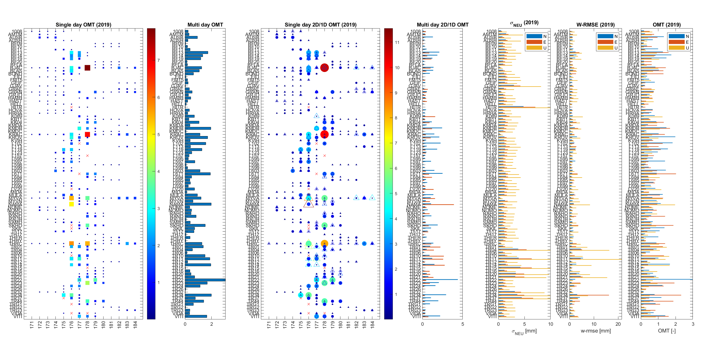

# GNSS Precise Point Positioning (PPP) Matlab Toolbox

**Version 1.2 (31 May 2024).**

## Synopsis

Functions and example script to read data from NRCan CSRS-PPP output files and combine the single day
solutions into a single multi-day solution with statistical testing.

Applications range from computing multiday station coordinates, with statistical testing, up to quality
control for a multi-week GNSS campaign with automatic outlier detection and powerful graphics.

## Functions

Main functions:

    xtrNRCAN        - Read NRCan CSRS-PPP summary files and extract (static position) PPP data.
    pppcombine      - Combine single(-day) PPP solutions into a single multi-day estimate.
    nrcanReadPos    - Read NRCan CSRS-PPP position file (kinematic position, clock, ZTD).

Pretty print:

    prtNRCAN        - Pretty print results from xtrNRCAN
    prtcombine      - Pretty print results from pppcombine

## Demo scripts and documentation

Several demonstration scripts are provided

    pppdemo1        - Basic demo reading CSRS-PPP output files and a single multi-day combined solution
    pppdemo2        - Advanced demo processing one year of Iceland PPP data.
    pppdemo2xl      - Idem, but with a bit more options.
    nrcanTopoPoints - Compute Topo Points from CSRS-PPP kinematic PPP results.

A full description for the first three scripts is given in [pppdemo1.md](./pppdemo1.md) and [pppdemo2.md](./pppdemo2.md),
including a brief description of the statistical testing in [pppdemo1.md](./pppdemo1.md).

## Dependencies

The demo scripts use several functions from the **crsutil-matlab-toolbox** which must be included in the Matlab search path.

(c) Hans van der Marel, Delft University of Technology, 2018-2025.
